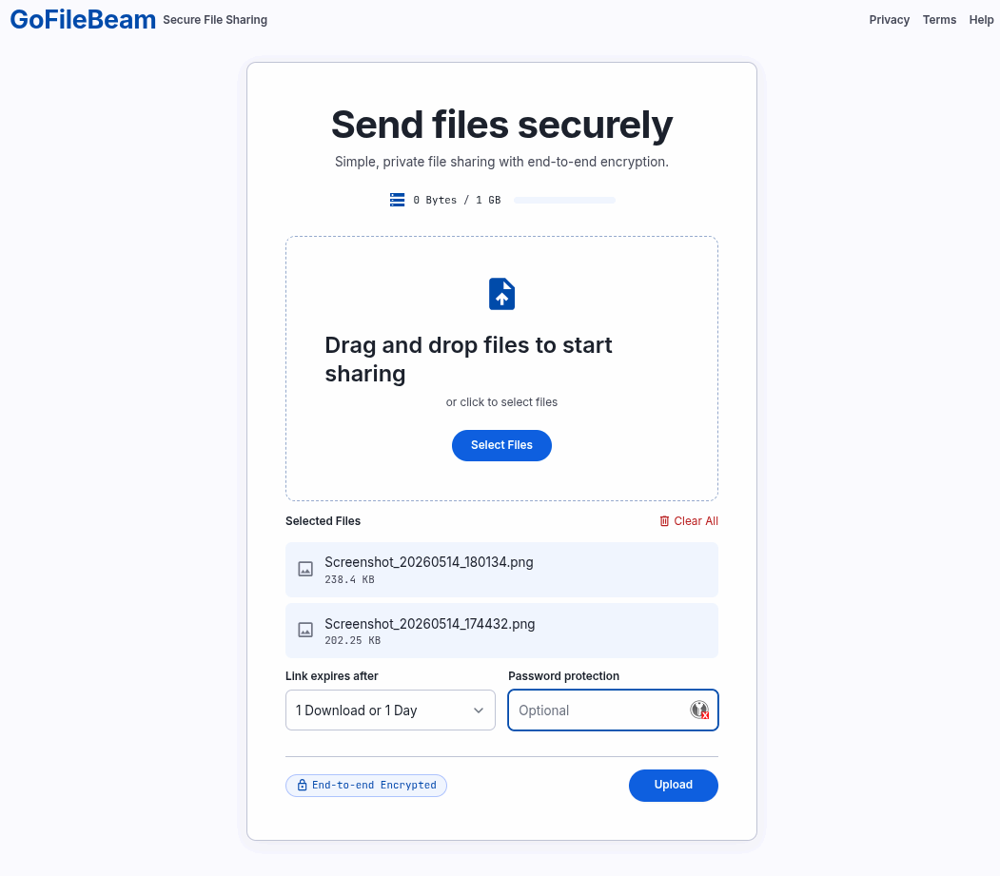

# GoFileBeam

A lightweight, secure file sharing service written in Go. Features end-to-end encryption, expiration policies, and storage quota management.



## Features

- **Secure File Sharing**: Upload files with optional password protection
- **End-to-End Encryption**: Files encrypted with AES-GCM before storage
- **Expiration Policies**: Files expire after specified downloads or time period
- **Storage Quota**: Configurable storage limit (default: 1GB)
- **Single Binary**: Easy deployment on any platform
- **REST API**: Simple API for integration
- **Web UI**: Built-in web interface for easy file sharing

## Quick Start

### Build

```bash
go build -o gofilebeam ./cmd/gofilebeam
```

### Run

```bash
./gofilebeam
```

The service will start on `http://localhost:8080` (or your configured port).

On startup, you'll see the security status:
```
✓ Sandbox initialized
✓ Rate limiter initialized (60 req/min)
✓ Brute force protection enabled
✓ File validation enabled
✓ Sandbox protection enabled
```

All security features are active by default.

## Configuration

Configure via environment variables:

| Variable | Description | Default |
|----------|-------------|---------|
| `GOFILEBEAM_PORT` | Server port | `8080` |
| `GOFILEBEAM_HOST` | Server host | `0.0.0.0` |
| `GOFILEBEAM_STORAGE_PATH` | Path for file storage | `./uploads` |
| `GOFILEBEAM_MAX_STORAGE_GB` | Maximum storage in GB | `1` |
| `GOFILEBEAM_MAX_FILE_SIZE_MB` | Maximum file size in MB | `100` |
| `GOFILEBEAM_ENABLE_HTTPS` | Enable HTTPS | `false` |
| `GOFILEBEAM_TLS_CERT_PATH` | TLS certificate path | - |
| `GOFILEBEAM_TLS_KEY_PATH` | TLS key path | - |
| `GOFILEBEAM_RATE_LIMIT_PER_MINUTE` | Rate limit per minute | `60` |
| `GOFILEBEAM_CLEANUP_INTERVAL_MINUTES` | Cleanup interval in minutes | `60` |

Example with custom configuration:

```bash
export GOFILEBEAM_PORT=3000
export GOFILEBEAM_MAX_STORAGE_GB=5
export GOFILEBEAM_STORAGE_PATH=/var/gofilebeam/uploads
./gofilebeam
```

## API Endpoints

### Upload File
```
POST /api/upload
Content-Type: multipart/form-data

Parameters:
- file: The file to upload
- expiration_option: "1 Download or 1 Day", "10 Downloads or 7 Days", or "100 Downloads or 30 Days"
- password: Optional password for encryption
```

### Download File
```
GET /api/download/{file_id}
GET /api/download/{file_id}?password={password}
```

### Storage Information
```
GET /api/storage
```

### Health Check
```
GET /api/health
```

## Web Interface

Access the web interface at `http://localhost:8080` (or your configured host/port).

The interface allows:
- Drag-and-drop file upload
- Password protection
- Expiration policy selection
- Real-time storage usage display

**Production CSS:** The project includes a pre-built, minified Tailwind CSS file (`static/css/output.css`) optimized for production use. If you need to modify the styles:

```bash
# In the project root directory (/home/ilfs/Public/GoFileBeam)

# Install dependencies (first time only)
npm install

# Rebuild CSS after making changes
npm run build:css

# Or watch for changes during development
npm run watch:css
```

## Security Features

GoFileBeam implements multiple layers of security to protect your files and prevent abuse:

### File Security
- **No File Type Restrictions**: Share any file type (.exe, .sh, .bat, etc.) - security via sandbox, not blocking
- **Filesystem Sandbox**: Files stored with 0444 permissions (read-only, no execute) - cannot run on server
- **AES-256-GCM Encryption**: Password-protected files encrypted with industry-standard encryption
- **Path Traversal Prevention**: All file paths validated to prevent directory escape attacks

### Access Control
- **Rate Limiting**: 60 requests/minute per IP (configurable) with automatic blocking after violations
- **Brute Force Protection**: Blocks IP after 5 failed password attempts for 30 minutes
- **Password Hashing**: Passwords hashed with SHA256 and unique salt per file

### Network Security
- **Security Headers**: XSS protection, frame denial, content-type sniffing prevention
- **HTTPS/TLS Support**: Optional TLS encryption for data in transit
- **CORS Configuration**: Controlled cross-origin access

### Data Management
- **Automatic Expiration**: Files auto-delete after time limit or download count
- **Storage Quota**: Prevents disk exhaustion with configurable limits
- **Real-time Monitoring**: Storage info reflects actual filesystem state

**For detailed information, see:**
- [docs/QUICKSTART.md](docs/QUICKSTART.md) - Quick start guide
- [docs/SECURITY.md](docs/SECURITY.md) - Complete security documentation
- [docs/GIT_SETUP.md](docs/GIT_SETUP.md) - Git configuration for contributors

## Deployment

### As a System Service (Linux)

Create a systemd service file `/etc/systemd/system/gofilebeam.service`:

```ini
[Unit]
Description=GoFileBeam File Sharing Service
After=network.target

[Service]
Type=simple
User=gofilebeam
Group=gofilebeam
WorkingDirectory=/opt/gofilebeam
Environment="GOFILEBEAM_STORAGE_PATH=/var/gofilebeam/uploads"
Environment="GOFILEBEAM_MAX_STORAGE_GB=10"
ExecStart=/opt/gofilebeam/gofilebeam
Restart=on-failure

[Install]
WantedBy=multi-user.target
```

### Docker

```bash
docker build -t gofilebeam .
docker run -p 8080:8080 -v ./uploads:/uploads gofilebeam
```

## Development

### Prerequisites
- Go 1.19 or later

### Build and Test

```bash
# Build
go build ./cmd/gofilebeam

# Run tests
go test ./...

# Run with race detector
go run -race ./cmd/gofilebeam
```

## Documentation

Additional documentation is available in the [`docs/`](docs/) directory:

- **[QUICKSTART.md](docs/QUICKSTART.md)** - Get started in 5 minutes
- **[SECURITY.md](docs/SECURITY.md)** - Complete security documentation
- **[GIT_SETUP.md](docs/GIT_SETUP.md)** - Git configuration guide for contributors

## License

MIT License